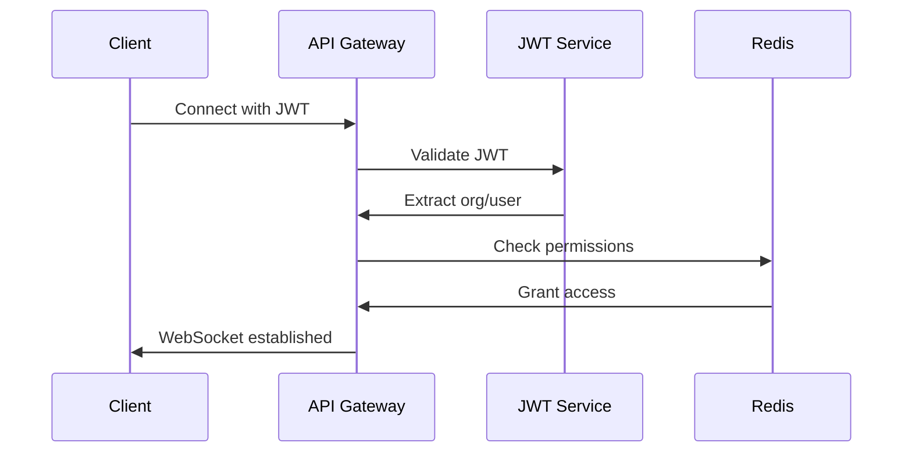

# AxonStream Neural Infrastructure

> **Enterprise-grade real-time platform with WebSocket infrastructure, multi-tenant architecture, and production-ready APIs.**

[](https://www.npmjs.com/package/@axonstream/core)
[](https://opensource.org/licenses/MIT)
[](http://www.typescriptlang.org/)

## 🚀 Quick Start

```bash
npm install @axonstream/core@2.0.0
```

```javascript
import { AxonPulsClient } from '@axonstream/core';

const client = new AxonPulsClient({
  url: 'wss://your-org.axonstream.ai',
  token: 'your-jwt-token'
});

await client.connect();
```

## 📚 Documentation

### Core Concepts
- [Architecture Overview](./architecture.md)
- [Authentication & Security](./authentication.md)
- [Multi-Tenant Design](./multi-tenant.md)

### SDK & APIs
- [JavaScript/TypeScript SDK](./sdk/javascript.md)
- [Python SDK](./sdk/python.md)
- [REST API Reference](./api/rest.md)
- [WebSocket API](./api/websocket.md)

### Framework Integration
- [React Integration](./frameworks/react.md)
- [Vue.js Integration](./frameworks/vue.md)
- [Angular Integration](./frameworks/angular.md)
- [Vanilla JavaScript](./frameworks/vanilla.md)

### Deployment & Operations
- [Docker Deployment](./deployment/docker.md)
- [Production Setup](./deployment/production.md)
- [Monitoring & Observability](./deployment/monitoring.md)
- [Performance Tuning](./deployment/performance.md)

## 🏗️ Architecture

AxonStream is built with enterprise-grade architecture:

```
┌─────────────────┐    ┌─────────────────┐    ┌─────────────────┐
│   Client SDKs   │    │   Load Balancer │    │   API Gateway   │
│                 │◄──►│                 │◄──►│                 │
│ React/Vue/JS/Py │    │    (HAProxy)    │    │   (NestJS)      │
└─────────────────┘    └─────────────────┘    └─────────────────┘
                                                       │
                       ┌─────────────────┐    ┌─────────────────┐
                       │   Redis Cluster │    │  PostgreSQL DB  │
                       │                 │◄──►│                 │
                       │ (Event Streams) │    │ (Multi-tenant)  │
                       └─────────────────┘    └─────────────────┘
```

## 🎯 Key Features

### Real-Time Communication
- **WebSocket Infrastructure**: High-performance real-time connections
- **Event Streaming**: Redis-based event routing and delivery
- **Auto Reconnection**: Self-healing connections with exponential backoff
- **Circuit Breaker**: Resilient error handling and recovery

### Enterprise Security
- **JWT Authentication**: RS256 algorithm with public/private key management
- **Multi-Tenant Isolation**: Organization-scoped data and channel separation
- **Rate Limiting**: Per-tenant and per-user request throttling
- **Audit Logging**: Comprehensive security and access logging

### Developer Experience
- **TypeScript First**: Full type safety and IntelliSense support
- **Framework Agnostic**: Works with React, Vue, Angular, or vanilla JS
- **Auto-Detection**: Automatic framework detection and adapter loading
- **Hot Module Replacement**: Development-friendly build system

### Production Ready
- **Docker Support**: Complete containerization with docker-compose
- **Health Checks**: Comprehensive monitoring endpoints
- **Graceful Shutdown**: Clean resource cleanup and connection handling
- **Horizontal Scaling**: Load balancer ready with session persistence

## 🚦 Getting Started

### Prerequisites
- Node.js 20+
- Docker & Docker Compose
- PostgreSQL 14+
- Redis 7+

### Installation

#### 1. Install the SDK
```bash
npm install @axonstream/core@2.0.0
```

#### 2. Set up your environment
```bash
# Clone the infrastructure
git clone https://github.com/AxonStream/core.git
cd core

# Start services
docker-compose up -d

# Generate JWT keys
cd apps/api
npm run generate:keys

# Run migrations
npm run migrate
```

#### 3. Initialize your client
```javascript
import { AxonPulsClient } from '@axonstream/core';

const client = new AxonPulsClient({
  url: process.env.AXONSTREAM_URL,
  token: process.env.AXONSTREAM_TOKEN,
  autoReconnect: true,
  debug: process.env.NODE_ENV === 'development'
});

// Connect and start receiving events
await client.connect();

client.on('message', (data) => {
  console.log('Received:', data);
});

// Send events
client.send('my-channel', {
  type: 'user-action',
  payload: { userId: '123', action: 'click' }
});
```

## 🔧 Framework Examples

### React
```jsx
import { useAxonStream } from '@axonstream/react-hooks';

function MyComponent() {
  const { client, isConnected, send } = useAxonStream({
    url: 'wss://your-org.axonstream.ai',
    token: yourJwtToken
  });

  const handleClick = () => {
    send('user-events', { action: 'button-click' });
  };

  return (
    <div>
      <p>Status: {isConnected ? 'Connected' : 'Disconnected'}</p>
      <button onClick={handleClick}>Send Event</button>
    </div>
  );
}
```

### Vue.js
```vue
<template>
  <div>
    <p>Status: {{ isConnected ? 'Connected' : 'Disconnected' }}</p>
    <button @click="sendEvent">Send Event</button>
  </div>
</template>

<script setup>
import { useAxonStream } from '@axonstream/core/adapters/vue';

const { client, isConnected, send } = useAxonStream({
  url: 'wss://your-org.axonstream.ai',
  token: yourJwtToken
});

const sendEvent = () => {
  send('user-events', { action: 'button-click' });
};
</script>
```

## 📊 Performance

AxonStream is built for scale:

- **Throughput**: 100,000+ messages/second per instance
- **Latency**: <5ms message delivery within same region
- **Connections**: 50,000+ concurrent WebSocket connections
- **Memory**: <2GB RAM usage at 10,000 connections
- **CPU**: <30% usage under normal load

## 🛡️ Security

### Authentication Flow


### Multi-Tenant Isolation
- **Organization Scoping**: All data isolated by organization ID
- **Channel Prefixing**: Automatic org prefix on all channels
- **Permission Matrix**: Role-based access control
- **Data Encryption**: TLS in transit, AES-256 at rest

## 🚀 Deployment

### Docker Production Setup
```yaml
version: '3.8'
services:
  axonstream-api:
    image: axonstream/api:latest
    environment:
      - NODE_ENV=production
      - JWT_PUBLIC_KEY=${JWT_PUBLIC_KEY}
      - DATABASE_URL=${DATABASE_URL}
      - REDIS_URL=${REDIS_URL}
    ports:
      - "3000:3000"
    
  axonstream-redis:
    image: redis:7-alpine
    command: redis-server --appendonly yes
    
  axonstream-db:
    image: postgres:14
    environment:
      - POSTGRES_DB=axonstream
      - POSTGRES_USER=${DB_USER}
      - POSTGRES_PASSWORD=${DB_PASSWORD}
```

### Kubernetes Deployment
```yaml
apiVersion: apps/v1
kind: Deployment
metadata:
  name: axonstream-api
spec:
  replicas: 3
  selector:
    matchLabels:
      app: axonstream-api
  template:
    metadata:
      labels:
        app: axonstream-api
    spec:
      containers:
      - name: api
        image: axonstream/api:latest
        ports:
        - containerPort: 3000
        env:
        - name: NODE_ENV
          value: "production"
```

## 📈 Monitoring

### Health Endpoints
- `GET /health` - Basic health check
- `GET /health/detailed` - Detailed system status
- `GET /metrics` - Prometheus metrics
- `GET /version` - Build and version info

### Key Metrics
- **Connection Count**: Active WebSocket connections
- **Message Throughput**: Messages per second
- **Error Rate**: Failed requests percentage
- **Response Time**: API response latencies
- **Memory Usage**: RAM utilization
- **CPU Usage**: Processor utilization

## 🤝 Contributing

1. Fork the repository
2. Create your feature branch (`git checkout -b feature/amazing-feature`)
3. Commit your changes (`git commit -m 'Add amazing feature'`)
4. Push to the branch (`git push origin feature/amazing-feature`)
5. Open a Pull Request

## 📄 License

This project is licensed under the MIT License - see the [LICENSE](LICENSE) file for details.

## 🔗 Links

- **Documentation**: [https://docs.axonstream.ai](https://docs.axonstream.ai)
- **GitHub**: [https://github.com/AxonStream](https://github.com/AxonStream)
- **npm Package**: [https://npmjs.com/package/@axonstream/core](https://npmjs.com/package/@axonstream/core)
- **Discord**: [Join our community](https://discord.gg/axonstream)

## 💬 Support

- **Documentation Issues**: Open an issue in this repository
- **SDK Bugs**: Report in the [core repository](https://github.com/AxonStream/core)
- **General Questions**: Join our [Discord community](https://discord.gg/axonstream)
- **Enterprise Support**: Contact enterprise@axonstream.ai

---

**Built with ❤️ by the AxonStream team**
